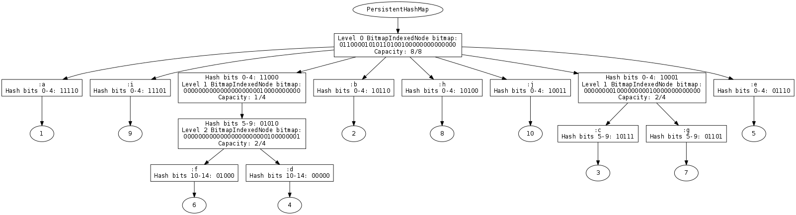
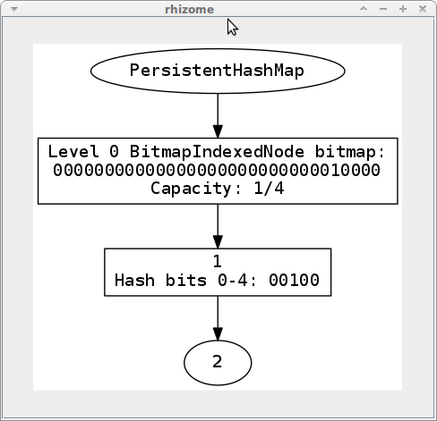

<p align="center">
  
</p>

## Hash Array Mapped Tries

This library contains: 

- a [reimplementation](#persistenthashmap-port) of Clojure's PersistentHashMap in Clojure
- [visualization tools](#visualizing-hamts) for the underlying trie.
- a [draft paper](#paper) that gives a from-scratch tutorial
  on hash array mapped tries.
- a [prototype](#keyword-map-optimizations) for dynamically generated `defrecord`s
  based on runtime key frequency.

It was completed as part of the B503 Algorithms graduate course
at Indiana University Bloomington (Fall 2016).
It was also just a great excuse to learn all this stuff.

## Paper

The accompanying [paper](paper/paper.pdf) gives a tutorial on HAMT's,
and outlines other details are required by my course which are less
useful for the casual reader.

## PersistentHashMap port

The top-level directory of this repository is a [Leiningen](http://leiningen.org/)
project containing a HAMT port.

To use, first [install Leiningen](http://leiningen.org/#install).

Start a REPL in the top-level directory of this repository.

```clojure
ambrose@ambrose-VirtualBox:~/Projects/B503/term-project$ lein repl
nREPL server started on port 41576 on host 127.0.0.1 - nrepl://127.0.0.1:41576
REPL-y 0.3.7, nREPL 0.2.12
Clojure 1.9.0-alpha13
Java HotSpot(TM) 64-Bit Server VM 1.8.0_101-b13
    Docs: (doc function-name-here)
          (find-doc "part-of-name-here")
  Source: (source function-name-here)
 Javadoc: (javadoc java-object-or-class-here)
    Exit: Control+D or (exit) or (quit)
 Results: Stored in vars *1, *2, *3, an exception in *e

user=> (require '[com.ambrosebs.map :as hamt])
nil
user=> 
```

The function `hamt/hash-map` then creates a new HAMT
with `com.ambrosebs.map.PersistentHashMap` as the underlying
type.

It is a full hash map with the same features as `clojure.lang.PersistentHashMap`.

```clojure
user=> (hamt/hash-map 1 2 2 3 3 4)
{1 2, 3 4, 2 3}
user=> (= (hamt/hash-map 1 2 2 3 3 4) {1 2 2 3 3 4})
true
user=> (into (hamt/hash-map) (zipmap (range 16) (range 16)))
{0 0, 7 7, 1 1, 4 4, 15 15, 13 13, 6 6, 3 3, 12 12, 
 2 2, 11 11, 9 9, 5 5, 14 14, 10 10, 8 8}
```

### Visualizing HAMTs

The `com.ambrosebs.map` namespace also comes with visualization capabilities.
It uses [rhizome](https://github.com/ztellman/rhizome) to create a new
window with the summarized HAMT.

```clojure
user=> (require '[com.ambrosebs.map.visualize :as viz])
nil
user=> (viz/visualize (hamt/hash-map 1 2))
nil
```

Here's what would pop up.

<p align="center">
  
</p>

Each internal level of the HAMT is rooted by either a 
`BitmapIndexedNode`, `HashCollisionNode`, or an
`ArrayNode`.

Most commonly, the resizable `BitmapIndexedNode` will
be the main branching internal node in your tree.

In the above example, the level is 0: that is the trie
is branching on the _first 5 bits_ of the key hashes.
The 32-bit bitmap is also displayed---here the 5th
bit is set to 1.
The current root node has allocated room for only 4 nodes
(which means an array of size 8 has been allocated for each
key-value pair).
The node also says only 1 spot of the possible 4 has been filled.
This number will increase as the node gets more branches.
After 16 entries, the root node will be replaced with an `ArrayNode`.

For larger HAMT's, it helps to output to `png` instead.
There's a roundabout way of doing this: first output to `dot`,
then use a terminal command to output a scaled `png`.

```clojure
;; write HAMT to example.dot
user=> (viz/dot-to-disk 
         (hamt/hash-map :a 1 :b 2 :c 3 :d 4 :e 5 
                        :f 6 :g 7 :h 8 :i 9 :j 10) 
         "example")
nil
```

Now, in the terminal, run:

```bash
cat example.dot  | dot -Gdpi=64 -Tpng:cairo:cairo > example.png
```

The output should be in `example.png`.

<p align="center">
  
</p>

For convenience, here are the hashes of each key, split
into 7 levels.

```
             6    5     4     3     2     1     0
(hash :a) = 10 00000 10110 11110 10111 11000 11110
(hash :b) = 01 01100 00101 10001 11100 11010 10110
(hash :c) = 10 01011 01110 01111 10100 10111 10001
(hash :d) = 01 11010 11000 11001 00000 01010 11000
(hash :e) = 01 01001 00101 01000 11111 10110 01110
(hash :f) = 10 10000 01100 11011 01000 01010 11000
(hash :g) = 01 10011 11001 10010 01001 01101 10001
(hash :h) = 01 00001 00010 01000 00011 00011 10100
(hash :i) = 10 10110 10101 01100 11110 11000 11101
(hash :j) = 10 10110 01010 11001 00110 01000 10011
```

There are a couple of extra details in these larger HAMT visualizations.

The children of a branching node are ordered in the same order at 
the bitmap. For example, `:e` is the far right
child of the root node because its entry is the
far right most (least significant) 1.

Now we can also see what happens when collisions happen
at a level. The hashes for `:c` and `:g` collide
in the first 5 bits (`10001`), so we create a new level
to disambiguate them on the next 5 bits
(`10111` and `01101` respectively for each).
Since the hash at bits 5-9 for `:g` is a lower number
that `:c`'s, it occurs on the left.

This disambiguation continues in the same way if collisions
happen in lower levels, like `:f` and `:d`, who share
the same first 10 bits in their hashes.
A level 2 node is used to disambiguate them at hash bits
10-14.

## Keyword map optimizations

I experimented with a cool little idea: generating `defrecord`s
at runtime.
The finished product wasn't too successful, but there seems
to be more to be said in this area.

A prototype is implemented in `com.ambrosebs.fast-attr`.
It is not a complete map implementation, but enough to run
a couple of benchmarks.

There are two main classes: 

- `UncachedMap`: a wrapper for `PersistentHashMap` that
  also remembers the keyword keys. If a specialized
  map for the current keyword keys set exists, then
  it is coerces into a `CachedMap*`  on the next `assoc`
  operation.
- `CachedMap*`: a family of record-like datatypes that
  offer a fast lookup on a fixed set of keys like `defrecord`.
  We compile many different variants for each common
  keyset (eg. `CachedMap1`, `CachedMap542`).
  On `assoc`, if there is a specialized `CachedMap*` available,
  it coerces to it, otherwise it defaults back to an 
  `UncachedMap`.

A separate thread performs the actual compilation, to avoid
too much overhead during `assoc`. 
(Below)

```clojure
(let [actually-me current-thread]
  (.start 
    (Thread.
      (fn []
        (loop []
          (Thread/sleep 100)
          ;; kill the thread if we recompile
          (when (= actually-me current-thread)
            (doseq [[k v] @keys-frequencies]
              (when (< gen-threshold v)
                (generate-fast-kw-map k)))
            (recur)))))))
```

Map `assoc` operations simply write to `keys-frequencies`,
incrementing a counter for the frequency of a given keyset.
If a keyset occurs more than `gen-threshold` times (set to 16),
a specialized `CachedMap*` is generated for the current keyset.

Since the optimizations happen on an `assoc` operation, a little
benchmark to show off the implementation is given that performs
20 assoc operations, with 100,000 lookups between each assoc.
(Below)

```clojure
(defn exercise-bench [f n]
  (loop [i 20
         m (f (into {:a 1 :b 2 :c 3 :d 4
                     :e 5 :f 6 :g 7 :h 8}
                    (map #(vector % %) (range n))))]
    (when-not (zero? i)
      (dotimes [_ 100000] 
        (+ (:a m) (:b m) (:c m) (:d m)
           (:e m) (:f m) (:g m) (:h m)))
      (recur (dec i) (update m :a inc)))))
```

The benchmark always runs with a fixed map 
`{:a 1 :b 2 :c 3 :d 4 :e 5 :f 6 :g 7 :h 8}`.
The `n` parameter with generate `n` extra entries,
designed to fill up the HAMT to show better performance
in the specialized versions.

We first test with zero extra keys.
For plain maps:

```clojure
user=> (time (fast/exercise-bench #(into {} %) 0))
"Elapsed time: 918.679767 msecs"
nil
```

For hand rolled `defrecords`:

```clojure
user=> (defrecord Exercise [a b c d e f g h])
user.Exercise
user=> (time (fast/exercise-bench map->Exercise 0))
"Elapsed time: 788.005321 msecs"
nil
```

For optimized maps:

```clojure
user=> (time (fast/exercise-bench fast/uncached-1arg 0))
"use optimised map"
"Elapsed time: 901.342483 msecs"
nil
user=> (time (fast/exercise-bench fast/uncached-1arg 0))
"use optimised map"
"Elapsed time: 785.89559 msecs"
```

The optimization takes a while to kick in, but seem to
show similar speedups as records.

For 1,000 extra keys, things are still looking ok for the
optimized map, which keeps up with records.

```clojure
user=> (time (fast/exercise-bench #(into {} %) 1000))
"Elapsed time: 1375.165084 msecs"
nil
user=> (time (fast/exercise-bench map->Exercise 1000))
"Elapsed time: 766.720069 msecs"
nil
user=> (time (fast/exercise-bench fast/uncached-1arg 1000))
"use optimised map"
"Elapsed time: 773.391029 msecs"
nil
user=> 
```

## Future work

It would be nice if the HAMT implementation in `com.ambrosebs.map`
could be swapped in as the default persistent map implementation
in Clojure. There is some preliminary work in `com.ambrosebs.map/install-map`,
but there's some stuff hardcoded in Compiler.java which is getting
in the way.

Then, transferring optimizations such as the one I experimented with
into a full implementation like `com.ambrosebs.map.PersistentHashMap`
would allow us to test on large programs that extensively
use plain maps as records (eg. tools.analyzer).

Enjoy!

## License

Copyright © 2016 Ambrose Bonnaire-Sergeant

Distributed under the Eclipse Public License either version 1.0 or (at
your option) any later version.
